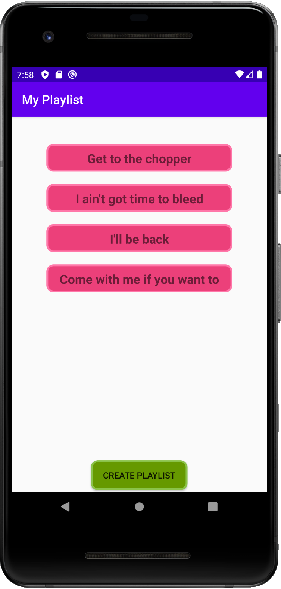

# Handy Tune
Android app for making playlists, music search, and more using the Spotify Web API. Group project for Android Programming course 2020.

## Requirements
* The user can perform searches on artist, album, and song
* The app can show all material belonging to an artist
* The user can create lists and add material to that list
* The user can save the playlist
* The app can change orientations (landscape/portrait)
* The app can be used on phones with different screen sizes without breaking or distorting the content
* The app can lookup and show a public Spotify user profile from an id

## Includes
* Fragments
* Web Service Call
* Adapters
* Room 
* and more

## Screenshots

 

 

 

